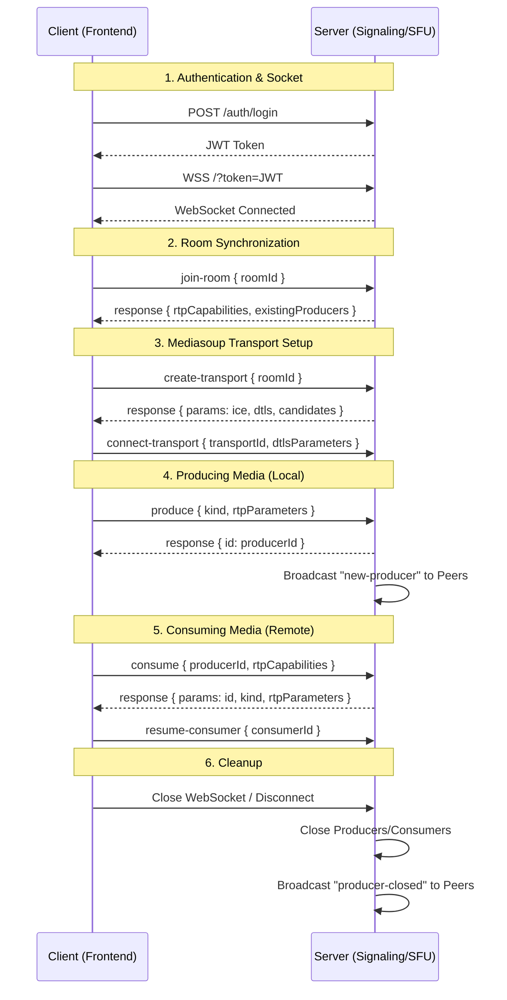

# 🎥 Mediasoup Meeting App (Monorepo)

A high-performance, secure, and modern WebRTC application built with **Mediasoup (SFU)**, **Bun**, and **Next.js 16**.

## 🚀 Quick Start

1.  **Install Bun**: `curl -fsSL https://bun.sh/install | bash`
2.  **Install dependencies**: `bun install`
3.  **Start Developing**: `bun dev` (Runs both `/apps/server` and `/apps/web`)

## 🏗️ Project Structure

- **`apps/server`**: Hono-based Signaling Server (Swagger Docs: `http://localhost:3001/docs`)
- **`apps/web`**: Next.js 16 Frontend (App Router, Tailwind 4)
- **`docs/`**: Detailed project documentation.

## 📡 Data Flow & Signaling

Below is the sequence of events between the Client (Next.js) and Server (Bun/Mediasoup) for a typical meeting session.




## 📚 Learning & Documentation

We've provided comprehensive documentation to help you understand the architecture, protocols, and deployment of this project:

-   **[Signaling & Media Flow](docs/architecture.md)**: Detailed events, diagrams, and example signaling data.
-   **[Signaling Server Deep-Dive](docs/server.md)**: Hono, Zod-OpenAPI, and WebSocket logic.
-   **[Web App Architecture](docs/web.md)**: Next.js 16, Mediasoup-client, and Frontend state.
-   [Mediasoup & SFU Core Concepts](docs/mediasoup.md): Routers, Transports, Producers, and Consumers.
-   [DevOps & Deployment](docs/devops.md): Docker, Husky, Compose, and Distroless security.
-   [Future Roadmap](docs/future_improvements.md): HLS Streaming and Performance Optimization.
-   [Architecture Directives](AGENTS.md): Project-level rules for AI engineering.


## 🐳 Docker Deployment

To spin up the full production environment locally:

```bash
docker compose up --build
```

---

*Built with ❤️ in 2026 using the latest tech stack.*
