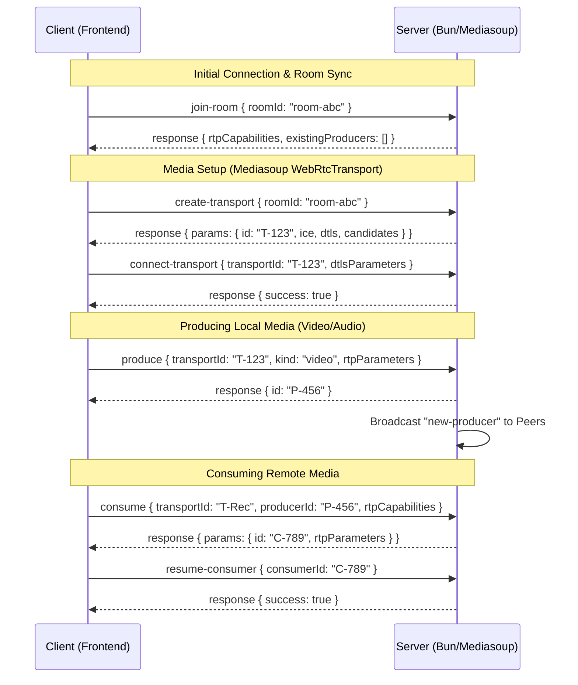

# 🏗️ System Architecture & Signaling Flow

This document details the signaling protocol and event flow between the Client (Next.js/Frontend) and the Server (Bun/Mediasoup). All WebSocket messages follow a request-response pattern or a broadcast pattern.

## 📡 Signaling Protocol

Messages are typically JSON objects with a `type` and a `data` field. Interaction usually involves a `requestId` for correlated responses.

### Sequence Diagram



---

## 📄 Event Reference with Example Data

Below are JSON examples for the signaling events handled in `apps/server/index.ts`.

### 1. `join-room`
The first action after a successful WebSocket connection.
- **Client Request**:
  ```json
  {
    "type": "join-room",
    "data": { "roomId": "room-abc" },
    "requestId": "R-1"
  }
  ```
- **Server Response**:
  ```json
  {
    "type": "response",
    "requestId": "R-1",
    "data": {
      "rtpCapabilities": { "codecs": [...], "headerExtensions": [...] },
      "existingProducers": [
        { "producerId": "P-99", "kind": "audio", "userName": "John", "userId": "user-1" }
      ]
    }
  }
  ```

### 2. `create-transport`
Requests the creation of a WebRTC transport on the server.
- **Client Request**:
  ```json
  {
    "type": "create-transport",
    "data": { "roomId": "room-abc" },
    "requestId": "R-2"
  }
  ```
- **Server Response**:
  ```json
  {
    "type": "response",
    "requestId": "R-2",
    "data": {
      "params": {
        "id": "T-123",
        "iceParameters": { "usernameFragment": "...", "password": "..." },
        "iceCandidates": [{ "foundation": "...", "ip": "1.2.3.4", "port": 10000, "priority": 100, "protocol": "udp", "type": "host" }],
        "dtlsParameters": { "fingerprints": [{ "algorithm": "sha-256", "value": "..." }], "role": "auto" }
      }
    }
  }
  ```

### 3. `connect-transport`
Establishes the WebRTC connection between client and server.
- **Client Request**:
  ```json
  {
    "type": "connect-transport",
    "data": {
      "transportId": "T-123",
      "dtlsParameters": { "fingerprints": [...], "role": "client" }
    },
    "requestId": "R-3"
  }
  ```
- **Server Response**:
  ```json
  {
    "type": "response",
    "requestId": "R-3",
    "data": { "success": true }
  }
  ```

### 4. `produce`
Uploads a local media track (send).
- **Client Request**:
  ```json
  {
    "type": "produce",
    "data": {
      "transportId": "T-123",
      "kind": "video",
      "rtpParameters": { "codecs": [...], "encodings": [...] }
    },
    "requestId": "R-4"
  }
  ```
- **Server Response**:
  ```json
  {
    "type": "response",
    "requestId": "R-4",
    "data": { "id": "P-456" }
  }
  ```
- **Broadcast (to other Peers)**:
  ```json
  {
    "type": "new-producer",
    "data": {
      "producerId": "P-456",
      "kind": "video",
      "userName": "Alice",
      "userId": "user-abc"
    }
  }
  ```

### 5. `consume`
Requests access to a remote media track (receive).
- **Client Request**:
  ```json
  {
    "type": "consume",
    "data": {
      "transportId": "T-REC",
      "producerId": "P-456",
      "rtpCapabilities": { "codecs": [...], ... }
    },
    "requestId": "R-5"
  }
  ```
- **Server Response**:
  ```json
  {
    "type": "response",
    "requestId": "R-5",
    "data": {
      "params": {
        "id": "C-789",
        "producerId": "P-456",
        "kind": "video",
        "rtpParameters": { "codecs": [...], ... }
      }
    }
  }
  ```

### 6. `resume-consumer`
Starts actual media flow after consumption setup.
- **Client Request**:
  ```json
  {
    "type": "resume-consumer",
    "data": { "consumerId": "C-789" },
    "requestId": "R-6"
  }
  ```
- **Server Response**:
  ```json
  {
    "type": "response",
    "requestId": "R-6",
    "data": { "success": true }
  }
  ```
